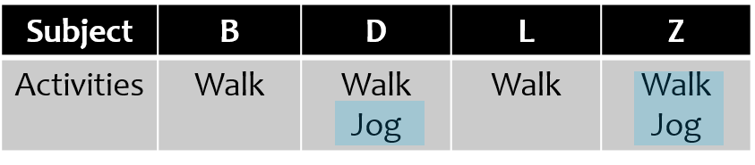
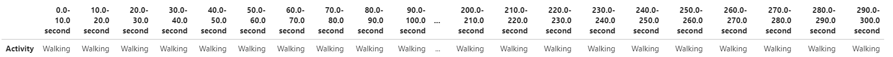

# Human activity recognition using time series data
***Author:*** Bill Fu  | Data Science Immersive @ General Assembly
## Problem Statement  

As you may noticed that the wearable devices are more and more common in our everyday life. Their market size is growing rapidly. In the year of 2019, the global wearable technology market was valued at 32.63 billion USD, and was projected to expand at a compound annual growth rate (CAGR) of 15.9% from 2020 to 2027<sup>[1]</sup>. Due to the huge impacts from COVID-19 pandamic, the growth might be even faster than prediction since people have more time for sports activities when staying/working at home.  

The wearable devices continuously generate huge amount of data. For example, According to researchers at IBM, "A person is likely to generate more than 1 million gigabytes of health-related data across the lifetime". This is just health-related data, not include all the other activities. The huge amount of data brings both challenges and opportunities. Can we obtain seamless data driven approaches that brings the maximum benefits from the data while minimize the risks? One of the most promising technique should be Machine learning, as it is super effective to work on big data.

The fitness and health management companies, as well as whoever uses wearable devices, will be very interested in how machine learning will help to effectively use the big data collected from the wearable devices. Such a case will be presented in this capestone project, where the goal is to recognize human activities using the time series data collected from smart phones. Classification models will be built from data collected from  both iPhones and Android phones. Accuracy will be used to measure the models. Lastly, the classification models will be used for a real time human activity monitoring system.


## Project directory
```
project
|__ code
|   |__ 01_MS_read_in.ipynb
|   |__ 02_WISDM-readin.ipynb
|   |__ 03_initial_md.ipynb
|   |__ 04_EDA.ipynb
|   |__ 05_parameter_scan_for_modelbuilding_data.ipynb
|   |__ 06_classification_models.ipynb
|   |__ 07_model_evaluation.ipynb
|   |__ 08_realtime_monitor.ipynb   
|__ imgs
|   |__ androd_data_af_stretch.JPG
|   |__ androd_data_bf_stretch.JPG
|   |__ cm_cnn.PNG
|   |__ collect_crowdsense.PNG
|   |__ model_summary.JPG
|   |__ realtime_monitor.GIF
|   |__ summary.PNG
|   |__ transfer_learning_results.PNG
|   |__ window_mbdata1.JPG
|__ 20201009_Capstone_HAR_byBillF.pdf
|__ README.md
```

## Executive Summary

Two sets of time series data were used for this project: one was collected by the Fortham University's wireless sensor data mining (WISDM) lab and the other was collected by the motion sense (MS) project at Queen Mary University of London. The WISDM datasets was acquired with Android phones and the MS datasets was acquired with iPhones. Both of the two datasets were collect for the 6 activies: sitting, standing, walking, jogging, going downstairs, and going upstairs.

I first built the models to recognize human activies for iPhone data and Android phone data separately. Then, the two datasets were calibrated and combined to build classification models which can be used for data from both phones. With the best cross-platform model, I collected data by my iPhone to validate the model. The original model didn't work well on the data I collected due the limitation of the training datasets. In order to recognize the activities from the data I collected, transfer learning on top of the cross-platfrom model was performed. Using the data I collected from **2** subjects for transfter learning, the new model worked well on all the data I collected from **4** subjects. After validation, the model was used to build a real time activity monitoring system. 

With certain extention, the real time monitoring system could be used for anomalies detection. All the work in this project could be applied to any time series data collected by wearable devices or internet of things(IoT).

## Preprocessing

There were four components recorded by the smart phones: attitude, gravity, rotation rate, and user acceleration. All of the 4 components were measured in 3 demensions: attitudes were used to measure the pose of the device, pitch was the rotation around x, roll was the rotation around y, and yaw was the rotation around z. The others were straightforward, and all are measured in 3 dimensions. The details explainations of the measures and the define of the axes could be found at this [website](https://ase.in.tum.de/lehrstuhl_1/teaching/tutorials/505-sgd-ws13-tutorial-core-motion).

The Android datasets only recorded the total acceleration which was the sum of the gravity and the user acceleration. This made the Android data only had 3 features which were the total accelerations in x, y and z directions, respectively. For the iPhone datasets, it had all the four components recorded therefore it had 12 features. Both of the Android and iPhone datasets had more than 1M samples points, recorded 6 activities. The Android datasets had 36 subjects, and the iPhone datasets had 24 subjects.

The time series data need to be converted into the format can be used to build models. The picture below was the total acceleration from the iPhone data for jogging.They were recorded in 3 dimensions. In this display, the horizontal direction is time, and the vertical is amplitude. In order to create the model building datasets, we needed to select the data in a window. For example, X1 here is one row in the training data, X2 is the next row. The number of samples included in X1 was defined as window length, and the shift from the beginning of X1 to the beginning of X2 was defined as the moving step. The window length and moving step for this "sliding window" scheme were needed to be optimized for both the iPhone and Android datasets.

<p>
    
    <Br>
    <em>Figure 1. Create model building datasets from time series data</em>
</p>


Next we need to match the iPhone and Android datasets. As one can see the Jogging data from Android data in Figure 2(a), it was very differnet from the iPhone data in Figure 1. More specifically, the Android data had more peaks than iPhone data in the same number of samples. This was because these two had different sampling frequency. We need to make sure the same window length stands for the same time peroid. In this case, the Android data was acquried at 20Hz and the iPhone data was aquired at 50Hz. Therefore the Android data needed to be stretched by 2.5 to match the iPhone data.
After stretching (as in Figure 2(b)), the Android data matche well to the iPhone data in time. Their amplitude could be matched by robostic scaler provided by the scikit learn library.

<p>
    
    <Br>
    <em>Figure 2(a). Create model building datasets from time series data</em>
</p>
<p>
    
    <Br>
    <em>Figure 2(b). Create model building datasets from time series data</em>
</p>


## Classification models comparison
After getting the model building datasets, a few models had been built and their results on testing datasets were summarized in Figure 3.
<p>
    
    <Br>
    <em>Figure 3. Model's accuracy comparison</em>
</p>

As one can see, the accuracy of logistic regression and knn models were poor. Support vector machine, random forest, and RNN LSTM  models performed OK. The CNN model was the best, and would be used for the project. Not only because of the high accuracy, but also the flexibility for transfer learning, as it would be illustrated later.

## Performance of the CNN Models

First, let’s look the performance of the CNN model built from the combined iPhone and Android phone datasets. 

| Datasets     	| WISDM dataset 	| MS dataset  	| Combined dataset 	|    
|-------------	|-------	|------	|----------	|     
| Accuracy   	| 0.94  	| 0.90 	| 0.92     	|  

The above table showed the predicting accuracies of the CNN model built from the combined datasets, 
We can see that it had high accuracy on both iPhone and Android datasets. This indicated a good cross platform model had been achieved.

Keep in mind that only 3 features were used in the combined data as the Android phone datasets only had total acceleration recorded. Next, using the iPhone datasets, two more things are tried for further improving the CNN model.
 
- Using more features
- Using all subjects in the training datasets ( This is the comparison on different ways to split train and test datasets: split by subjects or using all subjects, split by time)

The results of were listed in the bottom table, we could see that using more features and using all subjects in training could improve the CNN models.   

| Models      	| 3 features 	| 12 features  	| 12 features / all subjects in training 	|   
|-------------	|-------	|------	|----------	|  
| Accuracy  	| 0.90  	| 0.95 	| 0.99|   

The confusion matrices for the best CNN model were plotted in Figure 4. One can see that they are almost perfect.

<p>
    
    <Br>
    <em>Figure 4. Confusion matrices for the CNN model built from iPhone datasets using 12 features and all subjects in training. (left) Before normalization (right) After normalization</em>
</p>


## CNN Model validation and transfer learning

The CNN classification models were validated by the data collected using the iPhone app called ‘CrowdSense’. I have collected 2 activities (walking and jogging) from 4 subjects, as listed in Figure 5.
<p>
    
    <Br>
    <em>Figure 5. Data collected by iPhone App CrowdSense</em>
</p>

Applying the model to the new collected data, as you can see the accuracy was not so good, especially for jogging(See the middle column in Figure 6). 

The root cause the new collected data had very differnt patterns from the training datasets for the same activities(please refer to the project [presentation](./20201009_Capstone_HAR_byBillF.pdf) or [this notebook](./code/07_model_evaluation.ipynb) for details). In order to improve the classification model's performance on new collected data, we need to use transfer learning to build a new model on top of the CNN model.

The work flows are:
- Freeze the cnn model parameters
- Add 2 neural layers
- Use the new acquired data to train a model

Only part of these 3 datasets were used in this training (as highlighted in Figure 5 by blue markers).

This training was very fast. The accuracies of the new model were listed at the right column in Figure 6. We can see that the performance was significantly improved. Besides the jogging, it is worthy to note that using Z’s walk data to train model, the accuracy on other3’s walking also improved a lot.

<p>
    
    <Br>
    <em>Figure 6. CNN model validation and transfer learning results</em>
</p>


This transfer learning with data from new subjects was similar as calibrating google nest or “siri” before using.


## Implementation

With the well performed model, a real time activity monitoring system was implemented in the following steps:

- Read in the time series data from sensors
- Convert data into the format can be used by the model
- Classify the activities
- Map the activity back into time series
- Display the time series data and labels

The monitoring system was demonstrated in Figure 7. This was for walking. The first 3 charts were the total acceleration collected in 3 dimensions.The bottom chart was the classified activities. "5" stands for walking here. We can see the model works very well, with some minor errors too. Keep in mind that the time interval was 20ms here. Normally such a high resolution was not needed. The summary for every 10s for this case was listed at the bottom.

<p>
    
    
    <Br>
    <em>Figure 7. Real time human activity monitoring</em>
</p>


## Conclusions

In this project, classfication models were successfully built from time series data collected from smart phones to recognize human activities with high accuracies. The cross-platform models worked well for both the iPhones and Android phones. After a quick training with new collected data, the model works well for new subject’s data. A prototype of real-time human activities monitoring system had been built and demonstrated. All the work could be extended to any time series data from the wearable devices and internet of things (IoTs)

In the future, we can use multiple sensors to collect data at different locations for classifying more activities. At the same time, the real-time monitoring system could be used for detecting anomalies, such as falling.


## References  
1. [Wearable Technology Market Size, Share & Trends Analysis Report By Product (Wrist-wear, Eye-wear & Head-wear, Foot-wear, Neck-wear, Body-wear), By Application, By Region, And Segment Forecasts, 2020 - 2027](https://www.grandviewresearch.com/industry-analysis/wearable-technology-market)   
2. Jennifer R. Kwapisz, Gary M. Weiss and Samuel A. Moore (2010). Activity Recognition using Cell Phone Accelerometers, Proceedings of the Fourth International Workshop on Knowledge Discovery from Sensor Data (at KDD-10), Washington DC.  
3. Mohammad Malekzadeh, Richard G Clegg, Andrea Cavallaro, and Hamed Haddadi. 2018. Protecting sensory data against sensitive inferences. In Proceedings of the 1st Workshop on Privacy by Design in Distributed Systems. ACM, 2.  
4. Mohammad Malekzadeh, Richard G Clegg, and Hamed Haddadi. 2018. Replacement autoencoder: A privacy-preserving algorithm for sensory data analysis. In Internet-of-Things Design and Implementation (IoTDI), 2018 IEEE/ACM Third International Conference on. IEEE, 165--176.  


